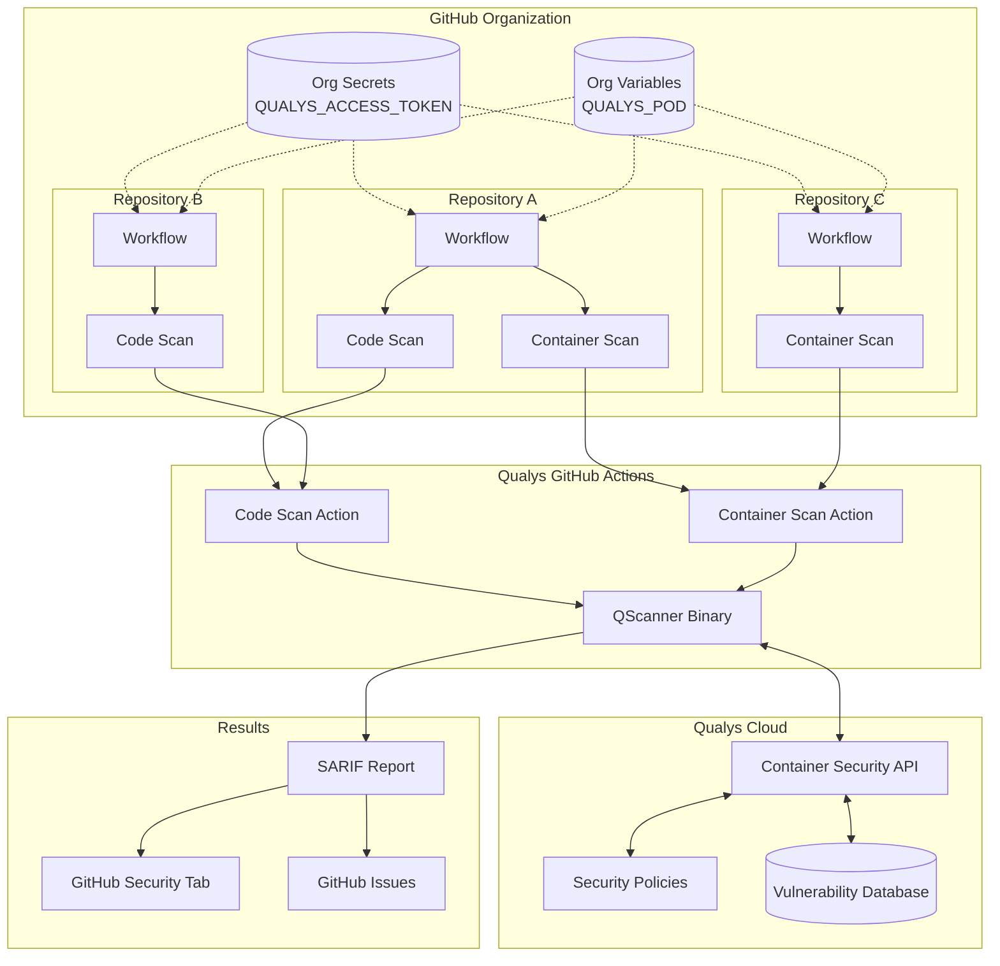
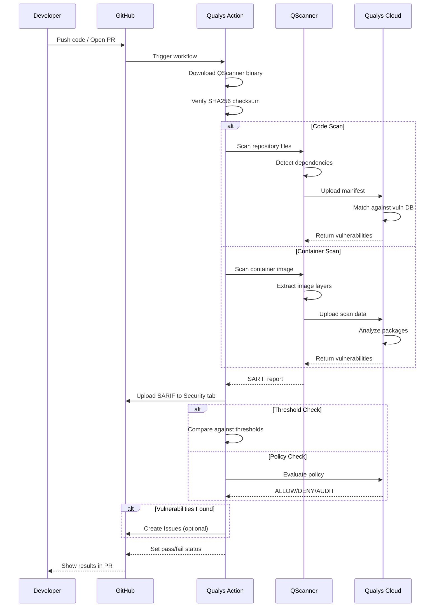
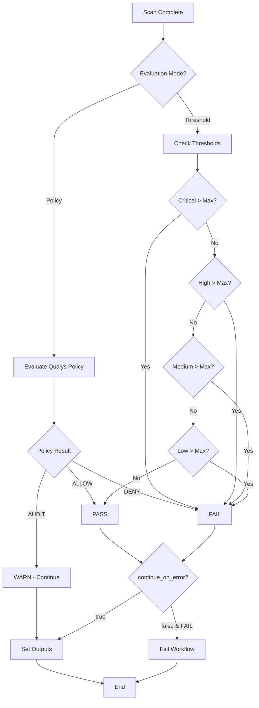
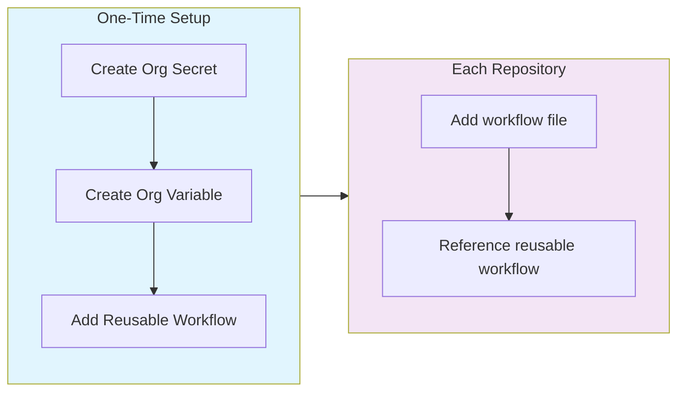
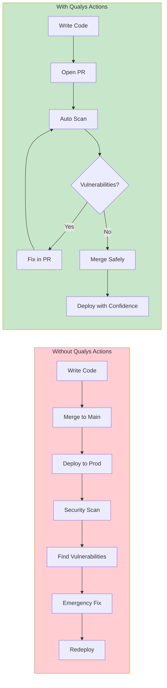
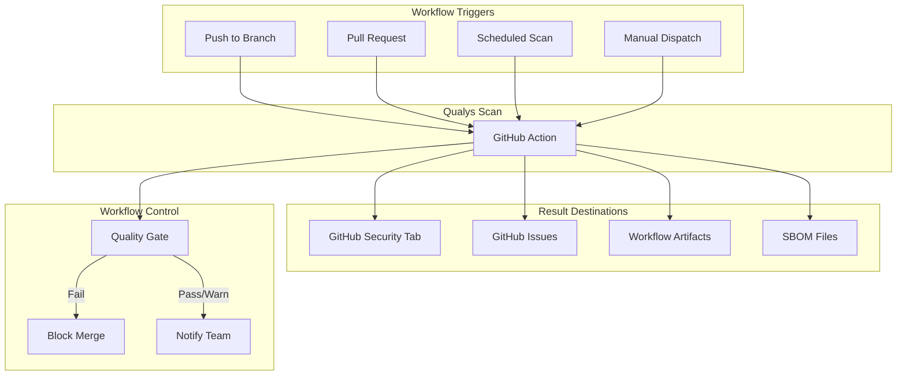
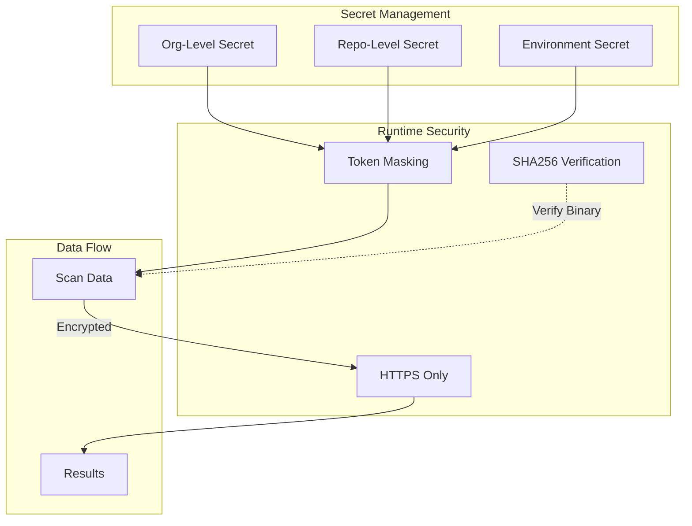

# Qualys GitHub Actions - Architecture & Design

## Why We Built This

Modern software development teams face an increasing challenge: shipping code quickly while ensuring security. Vulnerabilities in container images and third-party dependencies are among the top causes of security breaches. Traditional security scanning often happens too late in the development cycle, creating friction between security and development teams.

We built Qualys GitHub Actions to solve this by:

1. **Shifting Security Left** - Catch vulnerabilities during pull requests, not after deployment
2. **Developer-First Experience** - Results appear directly in GitHub where developers work
3. **Organization-Wide Consistency** - Deploy once, protect every repository
4. **Actionable Feedback** - Automatic issue creation and clear pass/fail criteria

## How It Works

### High-Level Architecture

### Scan Flow

### Pass/Fail Decision Logic

## Organization-Wide Deployment

### Setup Flow

### Three Deployment Options

```mermaid
flowchart TB
    subgraph Option1["Option 1: Direct Action"]
        R1[Repository] --> A1[uses: qualys/qualys-github/code-scan@v1]
        A1 --> Full1[Full configuration in each repo]
    end

    subgraph Option2["Option 2: Reusable Workflow"]
        R2[Repository] --> W2[uses: .github/workflows/qualys-code-scan.yml]
        W2 --> Shared2[Shared configuration]
    end

    subgraph Option3["Option 3: Starter Workflow"]
        R3[New Repository] --> New3[Actions → New Workflow]
        New3 --> Template3[Select Qualys template]
        Template3 --> Auto3[Auto-configured]
    end

    style Option1 fill:#ffebee
    style Option2 fill:#e8f5e9
    style Option3 fill:#fff3e0
```

## How It Helps Development Teams

### Vulnerability Lifecycle

### Integration Points

## Key Benefits

| Benefit | Description |
|---------|-------------|
| **Shift Left** | Find vulnerabilities during development, not after deployment |
| **Developer Experience** | Results in GitHub Security tab, automatic issue creation |
| **Org-Wide Coverage** | Single configuration protects all repositories |
| **Flexible Policies** | Local thresholds or centralized Qualys policies |
| **SBOM Generation** | Automatic software bill of materials for compliance |
| **Native Integration** | SARIF format for GitHub code scanning alerts |

## Security Model

The Qualys GitHub Actions are designed with security as a first principle:

- Access tokens are never logged and always masked
- Binary downloads are verified with SHA256 checksums
- All API communication uses HTTPS
- Results stay within your GitHub organization
